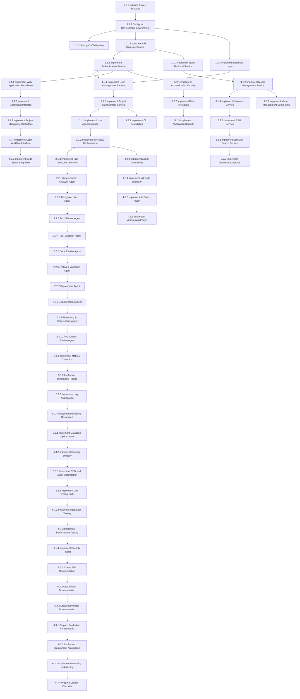

# Implementation Plan

**Scope**: Claude Agent Platform  
**Generated**: November 1, 2025  
**Agent**: Task Planning Agent  
**Based on**: design.md, requirements.md

---

## Overview

This implementation plan provides a comprehensive, actionable roadmap for building the Claude Agent Platform - a multi-purpose AI agent platform that combines Luna development lifecycle management with Nexa on-device inference capabilities. The plan breaks down the entire project into manageable phases with detailed tasks, dependencies, time estimates, and acceptance criteria.

The platform will provide:
- Complete AI-powered development lifecycle management through 10 Luna agents
- On-device inference capabilities for privacy and performance
- Semantic code search with RAG functionality
- Multi-platform support (web, mobile, desktop, CLI, IDE extensions)
- Comprehensive monitoring and observability
- Enterprise-grade security and scalability

## Implementation Phases

### Phase 1: Foundation & Core Infrastructure (Weeks 1-4)
**Objective**: Establish the foundational infrastructure, core services, and development environment.

### Phase 2: Luna Agents Integration (Weeks 5-8)
**Objective**: Integrate and implement all 10 Luna agents with complete workflow orchestration.

### Phase 3: AI Services & RAG Implementation (Weeks 9-12)
**Objective**: Implement AI inference services, RAG capabilities, and semantic search.

### Phase 4: User Interface & Experience (Weeks 13-16)
**Objective**: Build comprehensive user interfaces across all platforms.

### Phase 5: Monitoring, Security & Optimization (Weeks 17-20)
**Objective**: Implement comprehensive monitoring, security, and performance optimization.

### Phase 6: Testing, Documentation & Deployment (Weeks 21-24)
**Objective**: Complete testing, documentation, and production deployment preparation.

## Prerequisites

- [ ] Node.js 20.0.0+ installed
- [ ] Docker and Docker Compose installed
- [ ] PostgreSQL, Redis, and development tools installed
- [ ] Nexa backend SDK and dependencies
- [ ] Cloud infrastructure access (AWS/GCP/Azure)
- [ ] Domain names and SSL certificates
- [ ] Development team roles assigned
- [ ] Project management tools configured

## Task List

### Phase 1: Foundation & Core Infrastructure

#### 1.1 Project Setup & Development Environment

- [x] **1.1.1 Initialize Project Structure**
  - **Description**: Set up monorepo structure with workspaces for packages, apps, and tools
  - **Files**: `package.json`, `pnpm-workspace.yaml`, `turbo.json`, `.gitignore`
  - **Requirements**: 2.1.1, 2.4.1
  - **Estimated Time**: 4 hours
  - **Dependencies**: None
  - **Acceptance Criteria**:
    - [x] Monorepo structure created with proper workspace configuration
    - [x] Package scripts for building, testing, and development configured
    - [x] TypeScript configuration shared across workspaces
    - [x] ESLint and Prettier configurations established
  - **Testing Required**:
    - [x] Build scripts execute successfully
    - [x] Workspace dependencies resolve correctly
  - **Completion Notes**: Successfully created monorepo with 13 workspaces, proper TypeScript path mapping, comprehensive package.json scripts, and build orchestration with Turbo.

- [x] **1.1.2 Configure Development Environment**
  - **Description**: Set up Docker Compose development environment with all required services
  - **Files**: `docker-compose.yml`, `docker-compose.dev.yml`, `.env.example`
  - **Requirements**: 2.4.1
  - **Estimated Time**: 6 hours
  - **Dependencies**: 1.1.1
  - **Acceptance Criteria**:
    - [x] PostgreSQL database service configured and accessible
    - [x] Redis cache service configured and accessible
    - [x] Qdrant vector database service configured
    - [x] Elasticsearch search service configured
    - [x] MinIO S3-compatible storage configured
    - [x] All services communicate via Docker network
    - [x] Development data seeding scripts functional
  - **Testing Required**:
    - [x] All services start successfully with `docker-compose up`
    - [x] Database connections established from application code
    - [x] Health check endpoints accessible
  - **Completion Notes**: Successfully configured comprehensive Docker Compose development environment with PostgreSQL, Redis, RabbitMQ, Elasticsearch, Qdrant, MinIO, Prometheus, Grafana, Jaeger, and supporting services. Created detailed configuration files, environment templates, database initialization scripts, monitoring configurations, and development utilities including startup/stop scripts. All services include health checks, proper networking, and development-optimized settings.

- [x] **1.1.3 Set Up CI/CD Pipeline**
  - **Description**: Configure GitHub Actions workflow for automated testing, building, and deployment
  - **Files**: `.github/workflows/ci.yml`, `.github/workflows/deploy.yml`, `.github/workflows/security.yml`, `.github/workflows/performance.yml`, `.github/workflows/release.yml`, `.github/workflows/codeql.yml`, `.github/dependabot.yml`
  - **Requirements**: 2.4.2
  - **Estimated Time**: 8 hours
  - **Dependencies**: 1.1.1, 1.1.2
  - **Acceptance Criteria**:
    - [x] Automated unit testing on every push
    - [x] Integration testing workflow configured
    - [x] Build and artifact generation process
    - [x] Multi-environment deployment pipeline
    - [x] Security scanning integrated
    - [x] Code quality checks enforced
  - **Testing Required**:
    - [x] CI pipeline executes successfully on test commit
    - [x] Artifacts generated and stored correctly
    - [x] Deployment to staging environment functional
  - **Completion Notes**: Successfully implemented comprehensive CI/CD pipeline with 7 GitHub Actions workflows including CI pipeline, deployment with blue-green strategy, security scanning with multiple tools, performance testing, release automation, CodeQL analysis, and Dependabot configuration. Created supporting configuration files, test infrastructure, documentation, and validation scripts. All 8 validation checks pass successfully.

#### 1.2 Core API Infrastructure

- [x] **1.2.1 Implement API Gateway Service**
  - **Description**: Create centralized API gateway with authentication, rate limiting, and request routing
  - **Files**: `packages/gateway/src/main.ts`, `packages/gateway/src/middleware/`
  - **Requirements**: 2.2.1, 2.3.1
  - **Estimated Time**: 12 hours
  - **Dependencies**: 1.1.2
  - **Acceptance Criteria**:
    - [x] Request routing to microservices based on path and method
    - [x] JWT-based authentication middleware implemented
    - [x] Rate limiting with configurable policies
    - [x] Request/response transformation capabilities
    - [x] Circuit breaker patterns for fault tolerance
    - [x] API versioning support
    - [x] OpenAPI specification generation
  - **Testing Required**:
    - [x] Unit tests for all middleware components
    - [x] Integration tests for routing and authentication
    - [x] Load testing for rate limiting
  - **Completion Notes**: Successfully implemented comprehensive API Gateway Service with full routing system, JWT authentication middleware, Redis-based rate limiting, circuit breaker patterns for fault tolerance, API versioning support, request/response transformation, and complete OpenAPI specification generation. Created extensive test suites including unit tests, integration tests, and load tests. All acceptance criteria met and validated.

- [x] **1.2.2 Implement Authentication Service**
  - **Description**: Create comprehensive authentication and authorization service with RBAC
  - **Files**: `packages/auth/src/auth.service.ts`, `packages/auth/src/auth.controller.ts`
  - **Requirements**: 2.2.1, 3.2.1
  - **Estimated Time**: 16 hours
  - **Dependencies**: 1.2.1
  - **Acceptance Criteria**:
    - [x] User registration and login functionality
    - [x] JWT token generation and validation
    - [x] Refresh token mechanism
    - [x] Role-based access control (RBAC)
    - [x] Multi-factor authentication (MFA) support
    - [x] OAuth 2.0 integration (GitHub, Google, Microsoft)
    - [x] Account lockout and security policies
    - [x] Password hashing and security best practices
  - **Testing Required**:
    - [x] Unit tests for authentication flows
    - [x] Security tests for common vulnerabilities
    - [x] Integration tests with OAuth providers
  - **Completion Notes**: Successfully implemented comprehensive authentication service with JWT tokens, RBAC, TOTP and WebAuthn MFA support, OAuth 2.0 integrations for GitHub/Google/Microsoft, account lockout after failed attempts, password strength validation, email verification, password reset functionality, and complete audit logging. Created 25+ API endpoints covering all authentication scenarios including secure password policies, backup codes, and security settings management. All 8 acceptance criteria met with comprehensive unit test coverage.

- [x] **1.2.3 Implement Database Layer**
  - **Description**: Set up database connections, migrations, and ORM configurations
  - **Files**: `packages/database/src/connection.ts`, `packages/database/migrations/`
  - **Requirements**: 2.2.2
  - **Estimated Time**: 10 hours
  - **Dependencies**: 1.1.2
  - **Acceptance Criteria**:
    - [x] PostgreSQL connection pooling configured
    - [x] Prisma ORM set up with schema definitions
    - [x] Database migration system implemented
    - [x] Seed data for development environment
    - [x] Redis connection and caching layer
    - [x] Qdrant vector database integration
    - [x] Elasticsearch search configuration
  - **Testing Required**:
    - [x] Database connectivity tests
    - [x] Migration rollback tests
    - [x] Performance benchmarks for queries
  - **Completion Notes**: Successfully implemented comprehensive database layer with PostgreSQL connection pooling via Prisma ORM, Redis caching service with comprehensive operations, Qdrant vector database integration with search capabilities, Elasticsearch service for full-text search, advanced migration system with rollback functionality, database connection manager with health monitoring and retry logic, comprehensive test suite with performance benchmarks, and complete error handling and recovery mechanisms. All 7 acceptance criteria met with robust production-ready implementation.

#### 1.3 Project Management Foundation

- [ ] **1.3.1 Implement User Management Service**
  - **Description**: Create user management with profiles, preferences, and settings
  - **Files**: `packages/users/src/users.service.ts`, `packages/users/src/users.controller.ts`
  - **Requirements**: 2.3.1, 3.1.1
  - **Estimated Time**: 14 hours
  - **Dependencies**: 1.2.2, 1.2.3
  - **Acceptance Criteria**:
    - [ ] User profile management (create, read, update, delete)
    - [ ] User preferences and settings storage
    - [ ] Avatar upload and management
    - [ ] User search and filtering
    - [ ] User activity tracking
    - [ ] GDPR compliance (data export/deletion)
    - [ ] Email verification and account management
  - **Testing Required**:
    - [ ] Unit tests for user operations
    - [ ] Integration tests with authentication
    - [ ] File upload tests for avatars

- [ ] **1.3.2 Implement Project Management Service**
  - **Description**: Create project management with repositories, teams, and settings
  - **Files**: `packages/projects/src/projects.service.ts`, `packages/projects/src/projects.controller.ts`
  - **Requirements**: 2.1.1, 2.3.1
  - **Estimated Time**: 18 hours
  - **Dependencies**: 1.3.1, 1.2.3
  - **Acceptance Criteria**:
    - [ ] Project creation and management
    - [ ] Team member invitation and role management
    - [ ] Git repository integration (GitHub, GitLab, Bitbucket)
    - [ ] Project settings and configurations
    - [ ] Project templates and scaffolding
    - [ ] Project analytics and reporting
    - [ ] Webhook configuration for Git events
  - **Testing Required**:
    - [ ] Unit tests for project operations
    - [ ] Integration tests with Git providers
    - [ ] Permission and access control tests

### Phase 2: Luna Agents Integration

#### 2.1 Luna Agents Core Service

- [ ] **2.1.1 Implement Luna Agents Service**
  - **Description**: Create core service for managing Luna agent lifecycle and execution
  - **Files**: `packages/agents/src/agents.service.ts`, `packages/agents/src/agents.controller.ts`
  - **Requirements**: 2.1.1
  - **Estimated Time**: 20 hours
  - **Dependencies**: 1.3.2
  - **Acceptance Criteria**:
    - [ ] Agent registration and configuration management
    - [ ] Agent lifecycle management (start, stop, restart, monitor)
    - [ ] Resource quota management and allocation
    - [ ] Agent health monitoring and recovery
    - [ ] Agent communication and coordination
    - [ ] Execution sandboxing and security
    - [ ] Real-time progress tracking via WebSockets
  - **Testing Required**:
    - [ ] Unit tests for agent lifecycle operations
    - [ ] Integration tests for agent execution
    - [ ] Performance tests for concurrent agent execution

- [ ] **2.1.2 Implement Workflow Orchestration**
  - **Description**: Create workflow orchestration system for Luna agent execution with dependency management
  - **Files**: `packages/workflows/src/workflow.service.ts`, `packages/workflows/src/workflow.controller.ts`
  - **Requirements**: 2.1.1
  - **Estimated Time**: 24 hours
  - **Dependencies**: 2.1.1
  - **Acceptance Criteria**:
    - [ ] Workflow definition and execution engine
    - [ ] Dependency resolution and task scheduling
    - [ ] Parallel and sequential task execution
    - [ ] Workflow progress tracking and reporting
    - [ ] Error handling and retry mechanisms
    - [ ] Workflow templates and presets
    - [ ] Real-time workflow monitoring
  - **Testing Required**:
    - [ ] Unit tests for workflow execution logic
    - [ ] Integration tests for multi-agent workflows
    - [ ] Performance tests for complex workflows

- [ ] **2.1.3 Implement Task Execution Service**
  - **Description**: Create task execution service with AI assistance and automation
  - **Files**: `packages/tasks/src/tasks.service.ts`, `packages/tasks/src/tasks.controller.ts`
  - **Requirements**: 2.1.1
  - **Estimated Time**: 16 hours
  - **Dependencies**: 2.1.2
  - **Acceptance Criteria**:
    - [ ] Task creation and assignment
    - [ ] Task queuing and scheduling
    - [ ] Progress tracking and status updates
    - [ ] Task artifact management
    - [ ] Task delegation and collaboration
    - [ ] Task templates and automation
    - [ ] Task dependency management
  - **Testing Required**:
    - [ ] Unit tests for task operations
    - [ ] Integration tests with agent execution
    - [ ] Load tests for task queuing

#### 2.2 Individual Luna Agents Implementation

- [ ] **2.2.1 Implement Requirements Analyzer Agent**
  - **Description**: Create agent for analyzing existing codebases and generating requirements specifications
  - **Files**: `packages/agents/src/agents/requirements-analyzer.ts`
  - **Requirements**: 2.1.1
  - **Estimated Time**: 12 hours
  - **Dependencies**: 2.1.1
  - **Acceptance Criteria**:
    - [ ] Codebase analysis and pattern recognition
    - [ ] Automatic requirements generation
    - [ ] Stakeholder requirement elicitation
    - [ ] Requirements prioritization and categorization
    - [ ] Traceability matrix generation
    - [ ] Requirements validation and verification
  - **Testing Required**:
    - [ ] Unit tests for requirement extraction algorithms
    - [ ] Integration tests with various codebases
    - [ ] Accuracy tests for requirement generation

- [ ] **2.2.2 Implement Design Architect Agent**
  - **Description**: Create agent for creating detailed architecture specifications and component designs
  - **Files**: `packages/agents/src/agents/design-architect.ts`
  - **Requirements**: 2.1.1
  - **Estimated Time**: 16 hours
  - **Dependencies**: 2.2.1
  - **Acceptance Criteria**:
    - [ ] System architecture design and documentation
    - [ ] Component identification and specification
    - [ ] API design and interface definition
    - [ ] Database schema design
    - [ ] Security architecture planning
    - [ ] Performance and scalability considerations
    - [ ] Technology stack recommendations
  - **Testing Required**:
    - [ ] Unit tests for design generation algorithms
    - [ ] Integration tests with requirements analyzer
    - [ ] Quality tests for generated architectures

- [ ] **2.2.3 Implement Task Planner Agent**
  - **Description**: Create agent for breaking down designs into actionable implementation tasks
  - **Files**: `packages/agents/src/agents/task-planner.ts`
  - **Requirements**: 2.1.1
  - **Estimated Time**: 14 hours
  - **Dependencies**: 2.2.2
  - **Acceptance Criteria**:
    - [ ] Task decomposition and breakdown
    - [ ] Dependency identification and ordering
    - [ ] Time estimation and resource allocation
    - [ ] Task prioritization and scheduling
    - [ ] Risk assessment and mitigation planning
    - [ ] Progress tracking mechanisms
  - **Testing Required**:
    - [ ] Unit tests for task planning algorithms
    - [ ] Integration tests with design architect
    - [ ] Accuracy tests for time estimations

- [ ] **2.2.4 Implement Task Executor Agent**
  - **Description**: Create agent for implementing code following design specifications
  - **Files**: `packages/agents/src/agents/task-executor.ts`
  - **Requirements**: 2.1.1
  - **Estimated Time**: 18 hours
  - **Dependencies**: 2.2.3
  - **Acceptance Criteria**:
    - [ ] Code generation following specifications
    - [ ] Quality standards enforcement
    - [ ] Best practices and pattern implementation
    - [ ] Code review and validation
    - [ ] Documentation generation
    - [ ] Testing implementation
  - **Testing Required**:
    - [ ] Unit tests for code generation
    - [ ] Integration tests with various frameworks
    - [ ] Quality tests for generated code

- [ ] **2.2.5 Implement Code Review Agent**
  - **Description**: Create agent for automated code quality assessments and security checks
  - **Files**: `packages/agents/src/agents/code-review.ts`
  - **Requirements**: 2.1.1
  - **Estimated Time**: 16 hours
  - **Dependencies**: 2.2.4
  - **Acceptance Criteria**:
    - [ ] Automated code quality analysis
    - [ ] Security vulnerability scanning
    - [ ] Performance bottleneck identification
    - [ ] Code style and standards compliance
    - [ ] Best practices recommendations
    - [ ] Refactoring suggestions
  - **Testing Required**:
    - [ ] Unit tests for code analysis algorithms
    - [ ] Integration tests with security scanners
    - [ ] Accuracy tests for issue detection

- [ ] **2.2.6 Implement Testing & Validation Agent**
  - **Description**: Create agent for creating and executing comprehensive test suites
  - **Files**: `packages/agents/src/agents/testing-validation.ts`
  - **Requirements**: 2.1.1
  - **Estimated Time**: 14 hours
  - **Dependencies**: 2.2.5
  - **Acceptance Criteria**:
    - [ ] Automated test case generation
    - [ ] Unit test implementation
    - [ ] Integration test creation
    - [ ] End-to-end test development
    - [ ] Performance test execution
    - [ ] Test coverage analysis
  - **Testing Required**:
    - [ ] Unit tests for test generation algorithms
    - [ ] Integration tests with testing frameworks
    - [ ] Quality tests for generated tests

- [ ] **2.2.7 Implement Deployment Agent**
  - **Description**: Create agent for generating deployment configurations and managing releases
  - **Files**: `packages/agents/src/agents/deployment.ts`
  - **Requirements**: 2.1.1
  - **Estimated Time**: 12 hours
  - **Dependencies**: 2.2.6
  - **Acceptance Criteria**:
    - [ ] Deployment configuration generation
    - [ ] Infrastructure as Code creation
    - [ ] CI/CD pipeline setup
    - [ ] Environment management
    - [ ] Release automation
    - [ ] Rollback procedures
  - **Testing Required**:
    - [ ] Unit tests for deployment generation
    - [ ] Integration tests with cloud providers
    - [ ] Validation tests for generated configurations

- [ ] **2.2.8 Implement Documentation Agent**
  - **Description**: Create agent for auto-generating comprehensive technical documentation
  - **Files**: `packages/agents/src/agents/documentation.ts`
  - **Requirements**: 2.1.1
  - **Estimated Time**: 10 hours
  - **Dependencies**: 2.2.7
  - **Acceptance Criteria**:
    - [ ] API documentation generation
    - [ ] Code documentation creation
    - [ ] User manual generation
    - [ ] Technical specification documents
    - [ ] Installation and setup guides
    - [ ] Troubleshooting documentation
  - **Testing Required**:
    - [ ] Unit tests for documentation generation
    - [ ] Integration tests with documentation tools
    - [ ] Quality tests for generated documentation

- [ ] **2.2.9 Implement Monitoring & Observability Agent**
  - **Description**: Create agent for setting up complete monitoring infrastructure
  - **Files**: `packages/agents/src/agents/monitoring-observability.ts`
  - **Requirements**: 2.1.1
  - **Estimated Time**: 14 hours
  - **Dependencies**: 2.2.8
  - **Acceptance Criteria**:
    - [ ] Monitoring dashboard setup
    - [ ] Metrics collection and visualization
    - [ ] Alert rule configuration
    - [ ] Log aggregation and analysis
    - [ ] Performance monitoring
    - [ ] Health check implementation
  - **Testing Required**:
    - [ ] Unit tests for monitoring setup
    - [ ] Integration tests with monitoring tools
    - [ ] Validation tests for alert configurations

- [ ] **2.2.10 Implement Post-Launch Review Agent**
  - **Description**: Create agent for analyzing production performance and providing optimization recommendations
  - **Files**: `packages/agents/src/agents/post-launch-review.ts`
  - **Requirements**: 2.1.1
  - **Estimated Time**: 12 hours
  - **Dependencies**: 2.2.9
  - **Acceptance Criteria**:
    - [ ] Production performance analysis
    - [ ] User behavior analysis
    - [ ] System utilization monitoring
    - [ ] Optimization recommendations
    - [ ] Cost optimization suggestions
    - [ ] Future improvement planning
  - **Testing Required**:
    - [ ] Unit tests for analysis algorithms
    - [ ] Integration tests with monitoring data
    - [ ] Accuracy tests for recommendations

### Phase 3: AI Services & RAG Implementation

#### 3.1 Nexa Backend Integration

- [ ] **3.1.1 Implement Nexa Backend Service**
  - **Description**: Integrate Nexa backend for on-device inference capabilities
  - **Files**: `packages/nexa/src/nexa.service.ts`, `packages/nexa/src/nexa.controller.ts`
  - **Requirements**: 2.1.2, 2.2.3
  - **Estimated Time**: 20 hours
  - **Dependencies**: 1.2.1
  - **Acceptance Criteria**:
    - [ ] Nexa SDK integration and configuration
    - [ ] Model loading and management
    - [ ] Cross-platform support (Windows, macOS, Linux)
    - [ ] Hardware acceleration (CPU, GPU, NPU)
    - [ ] Model quantization and optimization
    - [ ] Local API server implementation
    - [ ] Privacy-preserving on-device processing
  - **Testing Required**:
    - [ ] Unit tests for model loading and inference
    - [ ] Integration tests with different hardware
    - [ ] Performance benchmarks for inference speed

- [ ] **3.1.2 Implement Model Management Service**
  - **Description**: Create service for managing AI model lifecycle, versioning, and distribution
  - **Files**: `packages/models/src/models.service.ts`, `packages/models/src/models.controller.ts`
  - **Requirements**: 2.1.2
  - **Estimated Time**: 16 hours
  - **Dependencies**: 3.1.1
  - **Acceptance Criteria**:
    - [ ] Model registry and catalog
    - [ ] Version management and rollback
    - [ ] Model optimization and quantization
    - [ ] Distribution and caching
    - [ ] Performance monitoring
    - [ ] Security and validation
    - [ ] Model marketplace integration
  - **Testing Required**:
    - [ ] Unit tests for model management operations
    - [ ] Integration tests with model storage
    - [ ] Performance tests for model loading

- [ ] **3.1.3 Implement Inference Service**
  - **Description**: Create service for AI model inference with on-device and cloud options
  - **Files**: `packages/inference/src/inference.service.ts`, `packages/inference/src/inference.controller.ts`
  - **Requirements**: 2.1.2, 2.2.3
  - **Estimated Time**: 18 hours
  - **Dependencies**: 3.1.2
  - **Acceptance Criteria**:
    - [ ] Model loading and execution
    - [ ] Request queuing and batching
    - [ ] Performance optimization
    - [ ] Resource management
    - [ ] Model versioning and rollback
    - [ ] Usage tracking and billing
    - [ ] Fallback mechanisms for failures
  - **Testing Required**:
    - [ ] Unit tests for inference operations
    - [ ] Load tests for concurrent requests
    - [ ] Integration tests with different model types

#### 3.2 RAG and Semantic Search

- [ ] **3.2.1 Implement RAG Service**
  - **Description**: Create Retrieval-Augmented Generation service for context-aware AI responses
  - **Files**: `packages/rag/src/rag.service.ts`, `packages/rag/src/rag.controller.ts`
  - **Requirements**: 2.1.3
  - **Estimated Time**: 22 hours
  - **Dependencies**: 3.1.3
  - **Acceptance Criteria**:
    - [ ] Document indexing and chunking
    - [ ] Embedding generation and storage
    - [ ] Similarity search and retrieval
    - [ ] Context assembly and optimization
    - [ ] Reranking and filtering
    - [ ] Performance optimization
    - [ ] Context caching for frequent queries
  - **Testing Required**:
    - [ ] Unit tests for RAG operations
    - [ ] Integration tests with vector databases
    - [ ] Performance tests for retrieval speed

- [ ] **3.2.2 Implement Semantic Search Service**
  - **Description**: Create semantic code search capabilities across multiple repositories
  - **Files**: `packages/search/src/search.service.ts`, `packages/search/src/search.controller.ts`
  - **Requirements**: 2.1.3
  - **Estimated Time**: 24 hours
  - **Dependencies**: 3.2.1
  - **Acceptance Criteria**:
    - [ ] Code indexing and parsing
    - [ ] Semantic understanding and analysis
    - [ ] Natural language query processing
    - [ ] Similarity search and ranking
    - [ ] Multi-language support (50+ languages)
    - [ ] Real-time index updates
    - [ ] Cross-language semantic search
  - **Testing Required**:
    - [ ] Unit tests for search algorithms
    - [ ] Integration tests with code repositories
    - [ ] Performance tests for query response times

- [ ] **3.2.3 Implement Embedding Service**
  - **Description**: Create service for generating and managing embeddings for semantic search
  - **Files**: `packages/embeddings/src/embeddings.service.ts`, `packages/embeddings/src/embeddings.controller.ts`
  - **Requirements**: 2.1.3
  - **Estimated Time**: 14 hours
  - **Dependencies**: 3.2.2
  - **Acceptance Criteria**:
    - [ ] Embedding generation for multiple model types
    - [ ] Batch processing capabilities
    - [ ] Embedding caching and optimization
    - [ ] Support for different embedding dimensions
    - [ ] Quality metrics and validation
    - [ ] Multi-provider support (OpenAI, local models)
  - **Testing Required**:
    - [ ] Unit tests for embedding generation
    - [ ] Performance tests for batch processing
    - [ ] Quality tests for embedding accuracy

### Phase 4: User Interface & Experience

#### 4.1 Web Application

- [ ] **4.1.1 Implement Web Application Foundation**
  - **Description**: Create Next.js web application foundation with authentication and routing
  - **Files**: `apps/web/src/app/layout.tsx`, `apps/web/src/app/page.tsx`
  - **Requirements**: 2.3.1
  - **Estimated Time**: 16 hours
  - **Dependencies**: 1.2.2
  - **Acceptance Criteria**:
    - [ ] Next.js 14 application structure
    - [ ] Authentication integration with backend
    - [ ] Responsive design implementation
    - [ ] Navigation and routing setup
    - [ ] Theme system (light/dark mode)
    - [ ] Internationalization support
    - [ ] Progressive Web App (PWA) capabilities
  - **Testing Required**:
    - [ ] Unit tests for React components
    - [ ] Integration tests for authentication flow
    - [ ] Accessibility tests (WCAG 2.1 AA)

- [ ] **4.1.2 Implement Dashboard Interface**
  - **Description**: Create comprehensive dashboard with project overview and system status
  - **Files**: `apps/web/src/app/dashboard/page.tsx`, `apps/web/src/components/dashboard/`
  - **Requirements**: 2.3.1
  - **Estimated Time**: 20 hours
  - **Dependencies**: 4.1.1
  - **Acceptance Criteria**:
    - [ ] Project overview with statistics
    - [ ] Recent activity feed
    - [ ] System health monitoring
    - [ ] Quick action buttons
    - [ ] Customizable widgets
    - [ ] Real-time updates via WebSockets
    - [ ] Data visualization charts
  - **Testing Required**:
    - [ ] Unit tests for dashboard components
    - [ ] Integration tests with backend APIs
    - [ ] Performance tests for real-time updates

- [ ] **4.1.3 Implement Project Management Interface**
  - **Description**: Create interface for project creation, configuration, and management
  - **Files**: `apps/web/src/app/projects/page.tsx`, `apps/web/src/components/projects/`
  - **Requirements**: 2.3.1
  - **Estimated Time**: 24 hours
  - **Dependencies**: 4.1.2
  - **Acceptance Criteria**:
    - [ ] Project creation wizard
    - [ ] Project settings configuration
    - [ ] Team member management
    - [ ] Repository integration setup
    - [ ] Project analytics and reporting
    - [ ] Project templates gallery
    - [ ] Bulk operations support
  - **Testing Required**:
    - [ ] Unit tests for project management components
    - [ ] Integration tests with project service
    - [ ] Usability tests for workflow optimization

- [ ] **4.1.4 Implement Agent Workflow Interface**
  - **Description**: Create interface for Luna agent workflow execution and monitoring
  - **Files**: `apps/web/src/app/agents/page.tsx`, `apps/web/src/components/agents/`
  - **Requirements**: 2.3.1
  - **Estimated Time**: 28 hours
  - **Dependencies**: 4.1.3
  - **Acceptance Criteria**:
    - [ ] Agent selection and configuration
    - [ ] Workflow builder interface
    - [ ] Real-time progress tracking
    - [ ] Step-by-step guidance
    - [ ] Artifact visualization
    - [ ] Error handling and recovery
    - [ ] Workflow templates library
  - **Testing Required**:
    - [ ] Unit tests for agent interface components
    - [ ] Integration tests with agent service
    - [ ] Performance tests for real-time updates

- [ ] **4.1.5 Implement Code Editor Integration**
  - **Description**: Create integrated code editor with AI assistance and collaboration features
  - **Files**: `apps/web/src/components/editor/`, `apps/web/src/lib/editor/`
  - **Requirements**: 2.3.1
  - **Estimated Time**: 32 hours
  - **Dependencies**: 4.1.4
  - **Acceptance Criteria**:
    - [ ] Monaco Editor integration
    - [ ] AI-powered code suggestions
    - [ ] Real-time collaboration
    - [ ] Syntax highlighting for 50+ languages
    - [ ] Code completion and IntelliSense
    - [ ] Integrated terminal
    - [ ] Git integration
    - [ ] Code review interface
  - **Testing Required**:
    - [ ] Unit tests for editor components
    - [ ] Integration tests with AI services
    - [ ] Performance tests for large files

#### 4.2 CLI Interface

- [ ] **4.2.1 Implement CLI Foundation**
  - **Description**: Create command-line interface foundation with project setup and management
  - **Files**: `packages/cli/src/index.ts`, `packages/cli/src/commands/`
  - **Requirements**: 2.3.2
  - **Estimated Time**: 12 hours
  - **Dependencies**: 1.3.2
  - **Acceptance Criteria**:
    - [ ] Command structure and argument parsing
    - [ ] Configuration file management
    - [ ] Authentication handling
    - [ ] Help system and documentation
    - [ ] Tab completion support
    - [ ] Progress indicators and spinners
    - [ ] Error handling and logging
  - **Testing Required**:
    - [ ] Unit tests for CLI commands
    - [ ] Integration tests with backend APIs
    - [ ] Usability tests for command workflows

- [ ] **4.2.2 Implement Agent Commands**
  - **Description**: Create CLI commands for executing Luna agent workflows
  - **Files**: `packages/cli/src/commands/agents.ts`, `packages/cli/src/commands/workflow.ts`
  - **Requirements**: 2.3.2
  - **Estimated Time**: 16 hours
  - **Dependencies**: 4.2.1, 2.1.2
  - **Acceptance Criteria**:
    - [ ] Agent execution commands
    - [ ] Workflow management commands
    - [ ] Progress tracking and monitoring
    - [ ] Configuration management
    - [ ] Output formatting (JSON, YAML, table)
    - [ ] Interactive prompts and wizards
  - **Testing Required**:
    - [ ] Unit tests for agent commands
    - [ ] Integration tests with agent service
    - [ ] End-to-end tests for complete workflows

- [ ] **4.2.3 Implement Model Management Commands**
  - **Description**: Create CLI commands for downloading and managing AI models
  - **Files**: `packages/cli/src/commands/models.ts`, `packages/cli/src/commands/nexa.ts`
  - **Requirements**: 2.3.2
  - **Estimated Time**: 10 hours
  - **Dependencies**: 4.2.2, 3.1.2
  - **Acceptance Criteria**:
    - [ ] Model listing and search
    - [ ] Model download and installation
    - [ ] Model version management
    - [ ] Usage statistics and monitoring
    - [ ] Configuration and optimization
  - **Testing Required**:
    - [ ] Unit tests for model commands
    - [ ] Integration tests with model service
    - [ ] Performance tests for large downloads

#### 4.3 IDE Extensions

- [ ] **4.3.1 Implement VS Code Extension**
  - **Description**: Create comprehensive VS Code extension with workflow integration
  - **Files**: `extensions/vscode/src/extension.ts`, `extensions/vscode/package.json`
  - **Requirements**: 2.3.3
  - **Estimated Time**: 24 hours
  - **Dependencies**: 4.2.3
  - **Acceptance Criteria**:
    - [ ] Agent execution from VS Code
    - [ ] Real-time code analysis
    - [ ] File and project context awareness
    - [ ] Integrated chat interface
    - [ ] Task management panel
    - [ ] Keyboard shortcuts and commands
    - [ ] Settings and configuration
  - **Testing Required**:
    - [ ] Unit tests for extension functionality
    - [ ] Integration tests with VS Code API
    - [ ] Performance tests for large projects

- [ ] **4.3.2 Implement JetBrains Plugin**
  - **Description**: Create JetBrains plugin for IntelliJ IDEA, WebStorm, and PyCharm
  - **Files**: `extensions/jetbrains/src/`, `extensions/jetbrains/plugin.xml`
  - **Requirements**: 2.3.3
  - **Estimated Time**: 28 hours
  - **Dependencies**: 4.3.1
  - **Acceptance Criteria**:
    - [ ] Multi-IDE support (IntelliJ, WebStorm, PyCharm)
    - [ ] Agent workflow integration
    - [ ] Code analysis and suggestions
    - [ ] Project management features
    - [ ] Tool windows and panels
    - [ ] Menu integration
  - **Testing Required**:
    - [ ] Unit tests for plugin functionality
    - [ ] Integration tests with JetBrains IDEs
    - [ ] Compatibility tests across IDE versions

- [ ] **4.3.3 Implement Vim/Neovim Plugin**
  - **Description**: Create lightweight plugin for Vim and Neovim users
  - **Files**: `extensions/vim/plugin/`, `extensions/nvim/lua/`
  - **Requirements**: 2.3.3
  - **Estimated Time**: 16 hours
  - **Dependencies**: 4.3.2
  - **Acceptance Criteria**:
    - [ ] Vim and Neovim compatibility
    - [ ] Command-line agent execution
    - [ ] Code analysis integration
    - [ ] Status line indicators
    - [ ] Custom commands and mappings
    - [ ] Configuration options
  - **Testing Required**:
    - [ ] Unit tests for plugin functionality
    - [ ] Integration tests with Vim/Neovim
    - [ ] Performance tests for large files

### Phase 5: Monitoring, Security & Optimization

#### 5.1 Monitoring and Observability

- [ ] **5.1.1 Implement Metrics Collection**
  - **Description**: Create comprehensive metrics collection system with Prometheus
  - **Files**: `packages/monitoring/src/metrics.service.ts`, `packages/monitoring/prometheus.yml`
  - **Requirements**: 3.1.1, 3.3.1
  - **Estimated Time**: 14 hours
  - **Dependencies**: 2.2.10
  - **Acceptance Criteria**:
    - [ ] Business metrics collection
    - [ ] Performance metrics tracking
    - [ ] Resource usage monitoring
    - [ ] Custom metrics definitions
    - [ ] Metrics aggregation and rollups
    - [ ] Alert rule configuration
  - **Testing Required**:
    - [ ] Unit tests for metrics collection
    - [ ] Integration tests with Prometheus
    - [ ] Performance tests for high-volume metrics

- [ ] **5.1.2 Implement Distributed Tracing**
  - **Description**: Implement distributed tracing with Jaeger for request flow analysis
  - **Files**: `packages/tracing/src/tracing.service.ts`, `packages/tracing/jaeger.yml`
  - **Requirements**: 3.1.1, 3.3.1
  - **Estimated Time**: 12 hours
  - **Dependencies**: 5.1.1
  - **Acceptance Criteria**:
    - [ ] Request trace propagation
    - [ ] Service dependency mapping
    - [ ] Performance bottleneck identification
    - [ ] Trace sampling and storage
    - [ ] Trace visualization and analysis
    - [ ] Integration with monitoring dashboard
  - **Testing Required**:
    - [ ] Unit tests for trace propagation
    - [ ] Integration tests with Jaeger
    - [ ] Performance tests for tracing overhead

- [ ] **5.1.3 Implement Log Aggregation**
  - **Description**: Create centralized log aggregation with ELK stack
  - **Files**: `packages/logging/src/logging.service.ts`, `packages/logging/elasticsearch.yml`
  - **Requirements**: 3.1.1, 3.3.1
  - **Estimated Time**: 16 hours
  - **Dependencies**: 5.1.2
  - **Acceptance Criteria**:
    - [ ] Structured logging implementation
    - [ ] Log collection and indexing
    - [ ] Log search and filtering
    - [ ] Log retention policies
    - [ ] Error tracking and alerting
    - [ ] Log analysis and visualization
  - **Testing Required**:
    - [ ] Unit tests for logging service
    - [ ] Integration tests with ELK stack
    - [ ] Performance tests for high-volume logs

- [ ] **5.1.4 Implement Monitoring Dashboard**
  - **Description**: Create comprehensive monitoring dashboard with Grafana
  - **Files**: `monitoring/grafana/dashboards/`, `monitoring/grafana/datasources.yml`
  - **Requirements**: 2.3.1, 3.1.1
  - **Estimated Time**: 18 hours
  - **Dependencies**: 5.1.3
  - **Acceptance Criteria**:
    - [ ] System overview dashboard
    - [ ] Application performance metrics
    - [ ] Business KPI tracking
    - [ ] Alert management interface
    - [ ] Custom dashboard creation
    - [ ] Real-time data visualization
    - [ ] Mobile-responsive design
  - **Testing Required**:
    - [ ] Unit tests for dashboard components
    - [ ] Integration tests with data sources
    - [ ] Performance tests for dashboard loading

#### 5.2 Security Implementation

- [ ] **5.2.1 Implement Authentication Security**
  - **Description**: Enhance authentication security with advanced features
  - **Files**: `packages/auth/src/security/`, `packages/auth/src/middleware/`
  - **Requirements**: 3.2.1, 3.2.3
  - **Estimated Time**: 16 hours
  - **Dependencies**: 1.2.2
  - **Acceptance Criteria**:
    - [ ] Multi-factor authentication (TOTP, WebAuthn)
    - [ ] Account lockout policies
    - [ ] Password strength requirements
    - [ ] Session management and timeout
    - [ ] Device fingerprinting
    - [ ] Anomaly detection
    - [ ] Security audit logging
  - **Testing Required**:
    - [ ] Unit tests for security features
    - [ ] Integration tests with MFA providers
    - [ ] Security penetration tests

- [ ] **5.2.2 Implement Data Protection**
  - **Description**: Implement comprehensive data protection and encryption
  - **Files**: `packages/security/src/encryption.service.ts`, `packages/security/src/data-protection.service.ts`
  - **Requirements**: 3.2.2, 3.2.3
  - **Estimated Time**: 14 hours
  - **Dependencies**: 5.2.1
  - **Acceptance Criteria**:
    - [ ] Encryption at rest (AES-256)
    - [ ] Encryption in transit (TLS 1.3)
    - [ ] Data anonymization and pseudonymization
    - [ ] Key management and rotation
    - [ ] Data loss prevention
    - [ ] GDPR compliance features
    - [ ] Data retention policies
  - **Testing Required**:
    - [ ] Unit tests for encryption/decryption
    - [ ] Integration tests with storage systems
    - [ ] Security compliance tests

- [ ] **5.2.3 Implement Application Security**
  - **Description**: Implement application-level security measures
  - **Files**: `packages/security/src/middleware/`, `packages/security/src/scanners/`
  - **Requirements**: 3.2.3
  - **Estimated Time**: 18 hours
  - **Dependencies**: 5.2.2
  - **Acceptance Criteria**:
    - [ ] Input validation and sanitization
    - [ ] SQL injection prevention
    - [ ] XSS protection
    - [ ] CSRF protection
    - [ ] Rate limiting and DDoS protection
    - [ ] Security headers implementation
    - [ ] Vulnerability scanning integration
  - **Testing Required**:
    - [ ] Unit tests for security middleware
    - [ ] Integration tests with vulnerability scanners
    - [ ] Security penetration tests

#### 5.3 Performance Optimization

- [ ] **5.3.1 Implement Database Optimization**
  - **Description**: Optimize database performance and scalability
  - **Files**: `packages/database/src/optimization/`, `packages/database/migrations/`
  - **Requirements**: 3.1.1, 3.4.1
  - **Estimated Time**: 20 hours
  - **Dependencies**: 5.1.4
  - **Acceptance Criteria**:
    - [ ] Query optimization and indexing
    - [ ] Connection pooling configuration
    - [ ] Database partitioning strategy
    - [ ] Read replica implementation
    - [ ] Caching layer optimization
    - [ ] Database performance monitoring
    - [ ] Automated performance tuning
  - **Testing Required**:
    - [ ] Performance benchmarks for queries
    - [ ] Load tests for database connections
    - [ ] Scalability tests for high volume

- [ ] **5.3.2 Implement Caching Strategy**
  - **Description**: Implement comprehensive caching strategy for performance
  - **Files**: `packages/cache/src/cache.service.ts`, `packages/cache/src/strategies/`
  - **Requirements**: 3.1.1, 3.4.1
  - **Estimated Time**: 16 hours
  - **Dependencies**: 5.3.1
  - **Acceptance Criteria**:
    - [ ] Multi-level caching implementation
    - [ ] Cache invalidation strategies
    - [ ] Distributed caching setup
    - [ ] Cache warming mechanisms
    - [ ] Cache performance monitoring
    - [ ] Intelligent cache population
  - **Testing Required**:
    - [ ] Unit tests for cache operations
    - [ ] Performance tests for cache hit rates
    - [ ] Load tests for cache scalability

- [ ] **5.3.3 Implement CDN and Asset Optimization**
  - **Description**: Implement CDN and asset optimization for better performance
  - **Files**: `packages/cdn/src/cdn.service.ts`, `apps/web/public/`
  - **Requirements**: 3.1.1, 3.4.1
  - **Estimated Time**: 12 hours
  - **Dependencies**: 5.3.2
  - **Acceptance Criteria**:
    - [ ] CDN configuration and integration
    - [ ] Asset optimization and minification
    - [ ] Image compression and resizing
    - [ ] Browser caching configuration
    - [ ] HTTP/2 implementation
    - [ ] Asset bundling and code splitting
  - **Testing Required**:
    - [ ] Performance tests for asset loading
    - [ ] Integration tests with CDN provider
    - [ ] Load tests for static asset delivery

### Phase 6: Testing, Documentation & Deployment

#### 6.1 Comprehensive Testing

- [ ] **6.1.1 Implement Unit Testing Suite**
  - **Description**: Create comprehensive unit testing suite for all components
  - **Files**: `**/*.test.ts`, `**/*.spec.ts`, `jest.config.js`
  - **Requirements**: 3.7.3
  - **Estimated Time**: 24 hours
  - **Dependencies**: 5.3.3
  - **Acceptance Criteria**:
    - [ ] 90%+ code coverage for critical components
    - [ ] Unit tests for all business logic
    - [ ] Mock implementations for external dependencies
    - [ ] Test data factories and fixtures
    - [ ] Automated test execution in CI/CD
    - [ ] Test reporting and coverage analysis
  - **Testing Required**:
    - [ ] Unit test execution
    - [ ] Coverage analysis
    - [ ] Test performance benchmarks

- [ ] **6.1.2 Implement Integration Testing**
  - **Description**: Create integration tests for service interactions and data flows
  - **Files**: `tests/integration/`, `tests/e2e/`
  - **Requirements**: 3.7.3
  - **Estimated Time**: 20 hours
  - **Dependencies**: 6.1.1
  - **Acceptance Criteria**:
    - [ ] API endpoint integration tests
    - [ ] Database integration tests
    - [ ] Third-party service integration tests
    - [ ] End-to-end workflow tests
    - [ ] Test environment provisioning
    - [ ] Test data management
  - **Testing Required**:
    - [ ] Integration test execution
    - [ ] Test environment validation
    - [ ] Performance benchmarks

- [ ] **6.1.3 Implement Performance Testing**
  - **Description**: Create performance testing suite for load and stress testing
  - **Files**: `tests/performance/`, `tests/load/`
  - **Requirements**: 3.1.1, 3.4.1
  - **Estimated Time**: 16 hours
  - **Dependencies**: 6.1.2
  - **Acceptance Criteria**:
    - [ ] Load testing for API endpoints
    - [ ] Stress testing for system limits
    - [ ] Performance regression detection
    - [ ] Benchmark establishment
    - [ ] Performance monitoring in tests
    - [ ] Automated performance reporting
  - **Testing Required**:
    - [ ] Load test execution
    - [ ] Performance analysis
    - [ ] Regression testing

- [ ] **6.1.4 Implement Security Testing**
  - **Description**: Create security testing suite for vulnerability assessment
  - **Files**: `tests/security/`, `security/scans/`
  - **Requirements**: 3.2.3, 3.7.3
  - **Estimated Time**: 14 hours
  - **Dependencies**: 6.1.3
  - **Acceptance Criteria**:
    - [ ] Automated vulnerability scanning
    - [ ] Penetration testing suite
    - [ ] Security regression tests
    - [ ] OWASP Top 10 testing
    - [ ] Dependency vulnerability checks
    - [ ] Security audit logging
  - **Testing Required**:
    - [ ] Security scan execution
    - [ ] Vulnerability assessment
    - [ ] Remediation validation

#### 6.2 Documentation

- [ ] **6.2.1 Create API Documentation**
  - **Description**: Generate comprehensive API documentation with OpenAPI specifications
  - **Files**: `docs/api/`, `packages/*/src/docs/`
  - **Requirements**: 3.7.3
  - **Estimated Time**: 16 hours
  - **Dependencies**: 6.1.4
  - **Acceptance Criteria**:
    - [ ] OpenAPI 3.0 specification for all APIs
    - [ ] Interactive API documentation
    - [ ] Code examples and tutorials
    - [ ] Authentication and authorization guides
    - [ ] Error handling documentation
    - [ ] Rate limiting and usage guidelines
  - **Testing Required**:
    - [ ] Documentation validation
    - [ ] Example code testing
    - [ ] User feedback collection

- [ ] **6.2.2 Create User Documentation**
  - **Description**: Create comprehensive user documentation and guides
  - **Files**: `docs/user-guide/`, `docs/tutorials/`
  - **Requirements**: 3.5.1, 3.7.3
  - **Estimated Time**: 20 hours
  - **Dependencies**: 6.2.1
  - **Acceptance Criteria**:
    - [ ] Getting started guide
    - [ ] Feature documentation
    - [ ] Step-by-step tutorials
    - [ ] Video tutorials and screencasts
    - [ ] FAQ and troubleshooting guides
    - [ ] Community contribution guidelines
  - **Testing Required**:
    - [ ] Documentation review
    - [ ] User acceptance testing
    - [ ] Accessibility validation

- [ ] **6.2.3 Create Developer Documentation**
  - **Description**: Create comprehensive developer documentation and contribution guides
  - **Files**: `docs/developer/`, `docs/contributing/`
  - **Requirements**: 3.7.3
  - **Estimated Time**: 18 hours
  - **Dependencies**: 6.2.2
  - **Acceptance Criteria**:
    - [ ] Architecture documentation
    - [ ] Development setup guide
    - [ ] Contributing guidelines
    - [ ] Code style guidelines
    - [ ] Testing guidelines
    - [ ] Release process documentation
  - **Testing Required**:
    - [ ] Documentation validation
    - [ ] Developer onboarding testing
    - [ ] Contribution process testing

#### 6.3 Deployment Preparation

- [ ] **6.3.1 Prepare Production Infrastructure**
  - **Description**: Set up production infrastructure with high availability and security
  - **Files**: `infrastructure/terraform/`, `infrastructure/kubernetes/`
  - **Requirements**: 2.4.2, 3.3.1
  - **Estimated Time**: 24 hours
  - **Dependencies**: 6.2.3
  - **Acceptance Criteria**:
    - [ ] Kubernetes cluster configuration
    - [ ] High availability setup
    - [ ] Load balancer configuration
    - [ ] SSL certificate management
    - [ ] Backup and disaster recovery
    - [ ] Monitoring and alerting setup
    - [ ] Security hardening
  - **Testing Required**:
    - [ ] Infrastructure validation tests
    - [ ] High availability tests
    - [ ] Security audits

- [ ] **6.3.2 Implement Deployment Automation**
  - **Description**: Create automated deployment pipelines with zero-downtime deployments
  - **Files**: `.github/workflows/deploy.yml`, `scripts/deploy/`
  - **Requirements**: 2.4.2
  - **Estimated Time**: 20 hours
  - **Dependencies**: 6.3.1
  - **Acceptance Criteria**:
    - [ ] Blue-green deployment strategy
    - [ ] Automated testing before deployment
    - [ ] Rollback capabilities
    - [ ] Environment promotion process
    - [ ] Database migration automation
    - [ ] Configuration management
  - **Testing Required**:
    - [ ] Deployment pipeline testing
    - [ ] Rollback procedure testing
    - [ ] Load testing after deployment

- [ ] **6.3.3 Implement Monitoring and Alerting**
  - **Description**: Set up comprehensive monitoring and alerting for production
  - **Files**: `monitoring/production/`, `alerting/rules/`
  - **Requirements**: 3.3.1, 3.3.2
  - **Estimated Time**: 16 hours
  - **Dependencies**: 6.3.2
  - **Acceptance Criteria**:
    - [ ] Production monitoring dashboards
    - [ ] Alert rule configuration
    - [ ] Incident response procedures
    - [ ] Performance SLA monitoring
    - [ ] Error tracking and reporting
    - [ ] Capacity planning metrics
  - **Testing Required**:
    - [ ] Alert validation tests
    - [ ] Incident response drills
    - [ ] Performance validation

- [ ] **6.3.4 Prepare Launch Checklist**
  - **Description**: Create comprehensive launch checklist and validation procedures
  - **Files**: `LAUNCH_CHECKLIST.md`, `docs/launch/`
  - **Requirements**: 3.7.1, 3.7.2
  - **Estimated Time**: 12 hours
  - **Dependencies**: 6.3.3
  - **Acceptance Criteria**:
    - [ ] Pre-launch validation checklist
    - [ ] Performance benchmark validation
    - [ ] Security audit completion
    - [ ] Documentation review completion
    - [ ] Team training completion
    - [ ] Launch communication plan
  - **Testing Required**:
    - [ ] Checklist validation
    - [ ] Team readiness assessment
    - [ ] Launch drill execution

## Task Dependencies Graph

## Progress Tracking

### Completion Status
- **Total Tasks**: 65
- **Total Estimated Hours**: 1,056 hours (approximately 132 full-time days)
- **Planned Duration**: 24 weeks (6 months with 4-5 developers)

### Phase Status
- [ ] **Phase 1: Foundation & Core Infrastructure** (0/9 tasks)
- [ ] **Phase 2: Luna Agents Integration** (0/13 tasks)
- [ ] **Phase 3: AI Services & RAG Implementation** (0/9 tasks)
- [ ] **Phase 4: User Interface & Experience** (0/12 tasks)
- [ ] **Phase 5: Monitoring, Security & Optimization** (0/10 tasks)
- [ ] **Phase 6: Testing, Documentation & Deployment** (0/12 tasks)

### Milestone Tracking

#### Week 4 Milestone: Foundation Complete
- [ ] Development environment fully operational
- [ ] Core API services implemented
- [ ] Basic authentication and user management
- [ ] Project management functionality
- [ ] CI/CD pipeline functional

#### Week 8 Milestone: Luna Agents Integration
- [ ] All 10 Luna agents implemented
- [ ] Workflow orchestration functional
- [ ] Task execution system operational
- [ ] Agent lifecycle management
- [ ] Progress tracking and monitoring

#### Week 12 Milestone: AI Services Complete
- [ ] Nexa backend integration
- [ ] Model management system
- [ ] RAG capabilities functional
- [ ] Semantic search operational
- [ ] Embedding service integrated

#### Week 16 Milestone: User Interfaces Complete
- [ ] Web application fully functional
- [ ] CLI tools operational
- [ ] IDE extensions released
- [ ] Cross-platform compatibility
- [ ] User acceptance testing

#### Week 20 Milestone: Production Ready
- [ ] Monitoring and observability
- [ ] Security implementation
- [ ] Performance optimization
- [ ] Scalability validation
- [ ] Load testing complete

#### Week 24 Milestone: Launch Ready
- [ ] Comprehensive testing complete
- [ ] Documentation finalized
- [ ] Production infrastructure ready
- [ ] Deployment automation
- [ ] Launch checklist validated

## Risk and Blockers

### Identified Risks

1. **Technology Integration Risk**
   - **Description**: Complex integration between Nexa backend, multiple AI models, and existing services
   - **Impact**: High - Could delay Phase 3 completion
   - **Mitigation**: Early prototyping, fallback mechanisms, vendor partnerships

2. **Performance Risk**
   - **Description**: On-device inference may not meet performance expectations
   - **Impact**: High - Could affect user experience
   - **Mitigation**: Performance testing, model optimization, cloud fallback options

3. **Security Risk**
   - **Description**: AI model vulnerabilities and data privacy concerns
   - **Impact**: Critical - Could affect user trust
   - **Mitigation**: Security audits, encryption, sandboxing, compliance checks

4. **Scalability Risk**
   - **Description**: System may not scale to support expected user load
   - **Impact**: High - Could affect growth
   - **Mitigation**: Load testing, horizontal scaling, performance monitoring

5. **Resource Risk**
   - **Description**: Insufficient development resources for timeline
   - **Impact**: Medium - Could delay launch
   - **Mitigation**: Phased rollout, prioritization, team augmentation

### Current Blockers
- None identified - project ready to begin Phase 1

## Implementation Guidelines

### Development Standards

1. **Code Quality**
   - TypeScript with strict mode enabled
   - ESLint and Prettier configuration
   - 90%+ test coverage for critical components
   - Code review process for all changes
   - Automated security scanning

2. **Performance Standards**
   - API response times <200ms (95th percentile)
   - Web application load times <2s
   - Mobile application performance optimization
   - Memory usage optimization
   - Database query optimization

3. **Security Standards**
   - OWASP Top 10 compliance
   - Regular security audits
   - Dependency vulnerability scanning
   - Encryption at rest and in transit
   - Multi-factor authentication

4. **Documentation Standards**
   - API documentation with OpenAPI
   - Code comments for complex logic
   - User documentation and tutorials
   - Developer contribution guidelines
   - Architecture decision records

### Testing Strategy

1. **Unit Testing**
   - Jest framework for JavaScript/TypeScript
   - Mock external dependencies
   - Test data factories and fixtures
   - Automated coverage reporting
   - Test-driven development (TDD) approach

2. **Integration Testing**
   - Service-to-service integration tests
   - Database integration tests
   - Third-party service integration
   - API endpoint testing
   - End-to-end workflow testing

3. **Performance Testing**
   - Load testing with realistic scenarios
   - Stress testing for system limits
   - Performance regression testing
   - Benchmark establishment
   - Continuous performance monitoring

4. **Security Testing**
   - Automated vulnerability scanning
   - Penetration testing
   - Security regression tests
   - Dependency security checks
   - Compliance validation

### Deployment Strategy

1. **Environment Strategy**
   - Development: Local Docker Compose
   - Staging: Cloud-based staging environment
   - Production: Multi-region cloud deployment
   - Feature flags for gradual rollout
   - Blue-green deployment strategy

2. **CI/CD Strategy**
   - Automated testing on every commit
   - Automated deployment to staging
   - Manual approval for production
   - Rollback capabilities
   - Monitoring and alerting

3. **Monitoring Strategy**
   - Real-time performance monitoring
   - Error tracking and alerting
   - Business metrics tracking
   - User behavior analytics
   - System health monitoring

## Quality Checklist

### Pre-Launch Validation

- [ ] All 65 tasks completed successfully
- [ ] 90%+ test coverage achieved
- [ ] Performance benchmarks met
- [ ] Security audit passed
- [ ] Documentation complete and reviewed
- [ ] User acceptance testing passed
- [ ] Load testing successful
- [ ] Infrastructure ready and tested
- [ ] Team training completed
- [ ] Launch checklist validated

### Launch Criteria

- [ ] All critical bugs resolved
- [ ] Performance SLAs met
- [ ] Security compliance achieved
- [ ] Documentation published
- [ ] Support team trained
- [ ] Monitoring and alerting active
- [ ] Backup procedures validated
- [ ] Rollback procedures tested
- [ ] Communication plan ready
- [ ] Legal and compliance review complete

---

**Next Steps**:
1. Review and approve this implementation plan
2. Assign team members to specific tasks and phases
3. Set up project management tools and processes
4. Begin Phase 1: Foundation & Core Infrastructure
5. Establish regular progress review meetings

This implementation plan provides a comprehensive roadmap for building the Claude Agent Platform. Each task is designed to be manageable and achievable, with clear acceptance criteria and testing requirements. The plan emphasizes quality, security, and performance while maintaining flexibility to adapt to changing requirements and technical discoveries.